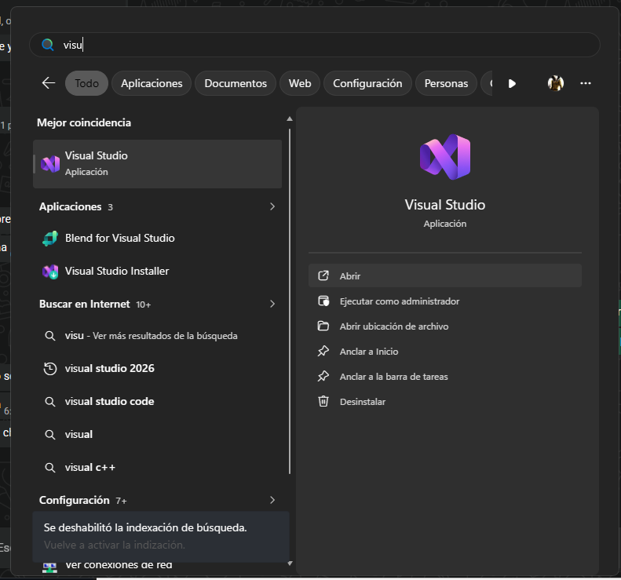
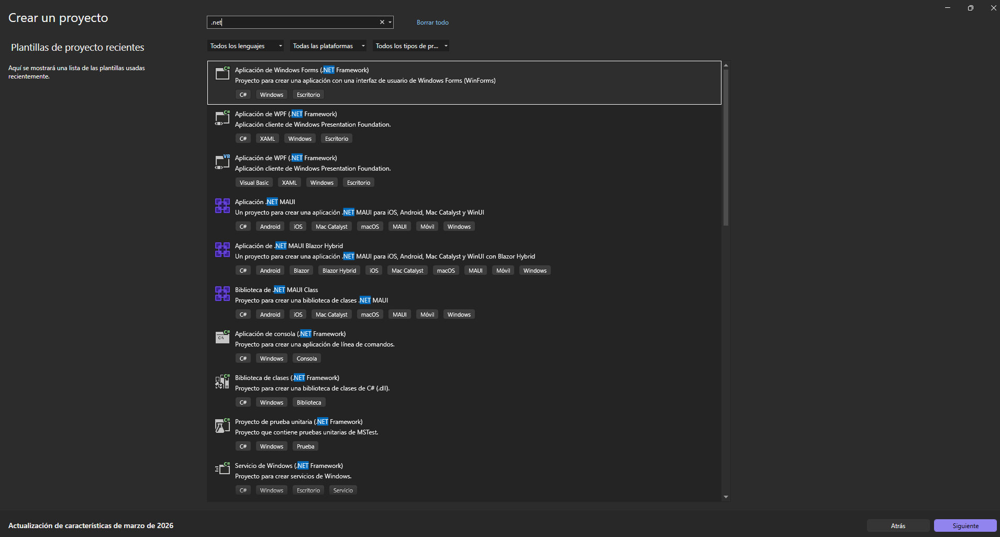
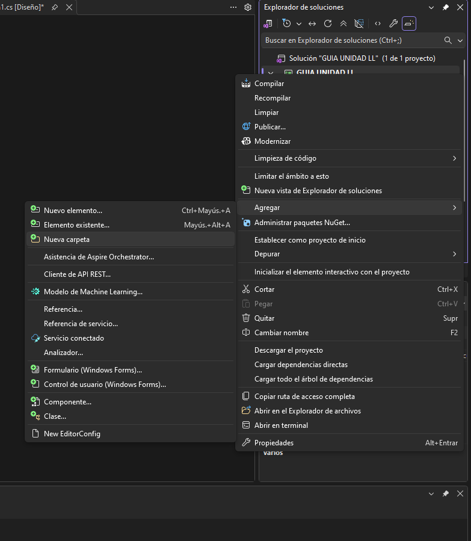
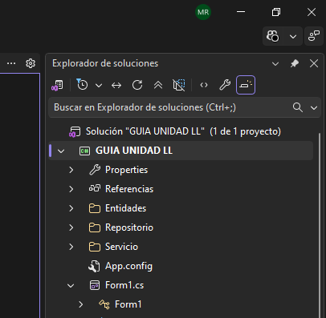
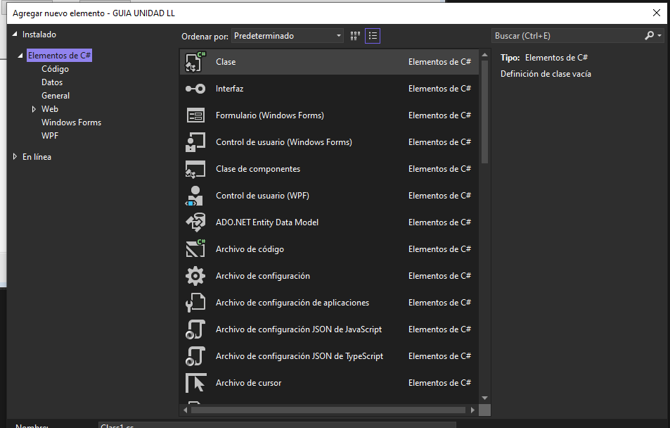
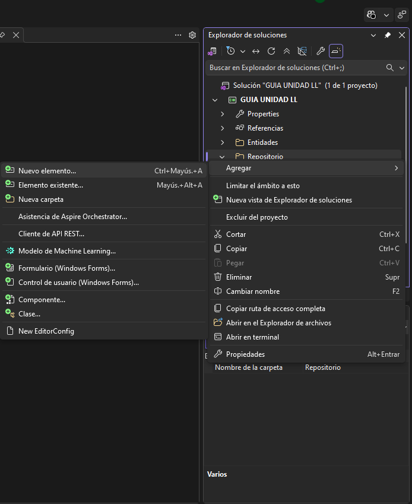
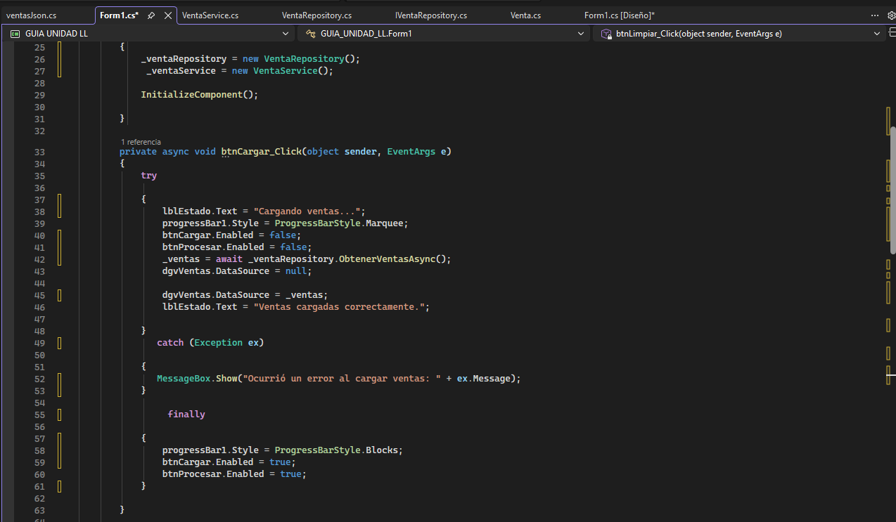

# CSharp-Ventas-UNI-Prog_I #2
[](https://skillicons.dev)

<h2>Sistema de Ventas con Concurrencia y Procesamiento Paralelo en C#</h2>

Este proyecto es una aplicación de escritorio desarrollada en C# con Windows Forms (.NET 6.0) que permite cargar y procesar ventas aplicando programación asíncrona, procesamiento paralelo (PLINQ) y el patrón Repository para separar la lógica del sistema.

El objetivo es implementar una solución que procese información sin bloquear la interfaz, manteniendo una estructura organizada del código.

## Funcionalidades ## 

<b>Carga de ventas asíncrona:</b> Obtiene datos sin bloquear la interfaz del usuario.<br>

<p><b>Procesamiento paralelo:</b> Uso de <code>AsParallel()</code> para optimizar cálculos.</p> 

<b>Cálculo de estadísticas:</b><br> 
- Total vendido <br> 
- Promedio de ventas<br> 
- Venta con mayor valor<br> 
- Agrupación por categoría<br>

<b>Interfaz dinámica:</b> 
- Visualización en <code>DataGridView</code><br> 
- Indicadores de estado y progreso<br> 
- Arquitectura desacoplada mediante patrón Repository<br>

<h2> Herramientas Tecnológicas</h2>

<!-- Badges -->
<p align="center">
  
  
  
  
  
  
</p>

<br>

<!-- Accordion -->
<details>
  <summary><strong>🔍 Ver detalle de tecnologías</h4></strong></summary>
  <br>
  <ul>
    <li>
      <strong> Lenguaje</strong><br>
      <sub>C# — Lenguaje principal orientado a objetos.</sub>
    </li>
    <br>
    <li>
      <strong> Framework</strong><br>
      <sub>.NET 6.0 o superior para desarrollo moderno.</sub>
    </li>
    <br>
    <li>
      <strong> Interfaz</strong><br>
      <sub>Windows Forms (WinForms) para aplicaciones de escritorio.</sub>
    </li>
    <br>
    <li>
      <strong> Concurrencia</strong><br>
      <sub>Uso de Task y async/await para operaciones no bloqueantes.</sub>
    </li>
    <br>
    <li>
      <strong> Paralelismo</strong><br>
      <sub>PLINQ (AsParallel) para procesamiento eficiente.</sub>
    </li>
    <br>
    <li>
      <strong> Serialización</strong><br>
      <sub>System.Text.Json (opcional) para manejo de datos.</sub>
    </li>
  </ul>

</details>

<h2>Documentación del Proyecto</h2>
Para comprender el desarrollo y los conceptos aplicados en esta práctica, puedes consultar la guía base utilizada:
<p align="left">
  <a href="https://github.com/xOfho/CSharp-FileSystem-UNI-Prog_I1/raw/main/docs/Guia_Practica_Prog_II.pdf">
    
  </a>
</p>

<h2> Estructura del Código</h2>

<table>
  <thead>
    <tr>
      <th>Archivo</th>
      <th>Descripción</th>
    </tr>
  </thead>
  <tbody>
    <tr>
      <td><code>Venta.cs</code></td>
      <td>Define la entidad principal con las propiedades de cada venta.</td>
    </tr>
    <tr>
      <td><code>IVentaRepository.cs</code></td>
      <td>Establece el contrato para la obtención de datos de ventas.</td>
    </tr>
    <tr>
      <td><code>VentaRepository.cs</code></td>
      <td>Simula la carga de datos de manera asíncrona.</td>
    </tr>
    <tr>
      <td><code>VentaService.cs</code></td>
      <td>Implementa la lógica de procesamiento paralelo de ventas.</td>
    </tr>
    <tr>
      <td><code>Form1.cs</code></td>
      <td>Gestiona la interacción del usuario y los eventos de la interfaz.</td>
    </tr>
  </tbody>
</table>

## Pasos a seguir: ##
1. Abrir Visual Studio 2022.<br>

2. Crear nuevo proyecto Windows Forms App (.NET).<br>
3. Asegurarse de seleccionar .NET 6.0 o superior.<br>

4. Crear tres carpetas en el proyecto:<br>
-  Entidades<br>
-  Repositorio<br>
-  Servicios<br>

5. Diseñar el formulario agregando los siguientes controles:<br>

-  DataGridView → <code>dgvVentas</code><br>
-  Button → <code>btnCargar</code><br>
-  Button → <code>btnProcesar</code><br>
-  Button → <code>btnLimpiar</code><br>
-  Label → <code>lblEstado</code><br>
-  ProgressBar → <code>progressBar1</code><br>
-  TextBox multilínea → <code>txtResultado</code><br>

Para que se Observe de ésta manera:<br>
<p align="left">
  
  Interfaz.png)

<p>6. Luego en la parte de Explorador de soluciones, dar click
derecho al proyecto, luego crear tres carpetas con estos nombres:
Entidades, Repositorio, Servicio.</p>

```csharp
public class Venta
{

    public int Id { get; set; }
    public string Producto { get; set; }
    public string Categoria { get; set; }
    public int Cantidad { get; set; }
    public decimal PrecioUnitario { get; set; }
    public DateTime Fecha { get; set; }
    
    public decimal Total
    {
        get { return Cantidad * PrecioUnitario; }
    }
} 
```
<p align="center">
  | 1.
  
  | 2.
  
</p>

7.  Crear la interfaz en la carpeta Repositorio
   ```csharp
public interface IVentaRepository
{
    Task<List<Venta>> ObtenerVentasAsync();
}
```
<p align="center">
  | 1.
  
  | 2.
  
</p>
8.  Crear la clase VentaRepository.cs

  ```csharp
public class VentaRepository : IVentaRepository
{
    public async Task<List<Venta>> ObtenerVentasAsync()
    {
        await Task.Delay(2000);

        return new List<Venta>
        {
            new Venta { Id = 1, Producto = "Laptop", Categoria = "Tecnología", Cantidad = 2, PrecioUnitario = 550m, Fecha = DateTime.Now.AddDays(-1) },
            new Venta { Id = 2, Producto = "Mouse", Categoria = "Tecnología", Cantidad = 5, PrecioUnitario = 20m, Fecha = DateTime.Now.AddDays(-2) },
            new Venta { Id = 3, Producto = "Teclado", Categoria = "Tecnología", Cantidad = 3, PrecioUnitario = 35m, Fecha = DateTime.Now.AddDays(-3) },
            new Venta { Id = 4, Producto = "Silla", Categoria = "Oficina", Cantidad = 2, PrecioUnitario = 120m, Fecha = DateTime.Now.AddDays(-2) },
            new Venta { Id = 5, Producto = "Escritorio", Categoria = "Oficina", Cantidad = 1, PrecioUnitario = 250m, Fecha = DateTime.Now.AddDays(-4) },
            new Venta { Id = 6, Producto = "Monitor", Categoria = "Tecnología", Cantidad = 4, PrecioUnitario = 180m, Fecha = DateTime.Now.AddDays(-1) }       
        }
    };
}

```
9.  Crear el servicio en la carpeta Servicios
  ```csharp
    using System.Text;
using System.Linq;

public class VentaService
{
    public async Task<string> ProcesarVentasAsync(List<Venta> ventas)
    {
        return await Task.Run(() =>
        {
            StringBuilder sb = new StringBuilder();

            decimal totalVendido = ventas.AsParallel().Sum(v => v.Total);
            decimal promedio = ventas.AsParallel().Average(v => v.Total);

            Venta ventaMayor = ventas.AsParallel()
                .OrderByDescending(v => v.Total)
                .FirstOrDefault();

            sb.AppendLine("===== REPORTE DE VENTAS =====");
            sb.AppendLine($"Total vendido: {totalVendido:C}");
            sb.AppendLine($"Promedio: {promedio:C}");

            if (ventaMayor != null)
            {
                sb.AppendLine($"Venta mayor: {ventaMayor.Producto}");
            }

            return sb.ToString();
        });
    }
}
```
10. Programar el formulario (constructor)
  ```csharp
private readonly IVentaRepository _ventaRepository;
private readonly VentaService _ventaService;
private List<Venta> _ventas;

public Form1()
{
    _ventaRepository = new VentaRepository();
    _ventaService = new VentaService();
    InitializeComponent();
}

```
11. Evento del botón ¨Cargar¨
<p align="center">
  
</p>

  ```csharp
private async void btnCargar_Click(object sender, EventArgs e)
{
    _ventas = await _ventaRepository.ObtenerVentasAsync();
    dgvVentas.DataSource = _ventas;
}
```
12. Evento del botón Procesar
  ```csharp
private async void btnProcesar_Click(object sender, EventArgs e)
{
    string reporte = await _ventaService.ProcesarVentasAsync(_ventas);
    txtResultado.Text = reporte;
}
```
13. Evento del botón Limpiar
  ```csharp
private void btnLimpiar_Click(object sender, EventArgs e)
{
    dgvVentas.DataSource = null;
    txtResultado.Clear();
}
```
## Cómo ejecutarlo ##
-  Abrir la solución con Visual Studio.<br>
-  Tener instalado .NET 6.0 o superior.<br>
-  Ejecutar con CTRL + F5.<br>

# Contribuidores
<a href="https://github.com/ThePhilos/CSharp-Ventas-UNI-Prog_I2/graphs/contributors">
<table align="center">
  <tr>
    <td align="center">
      <a href="https://github.com/ThePhilos">
        <br />
        <sub><b>ThePhilos</b></sub>
      </a>
    </td>
    <td align="center">
      <a href="https://github.com/maurijrbs">
        <br />
        <sub><b>maurijrbs</b></sub>
      </a>
    </td>
    <td align="center">
      <a href="https://github.com/xOfho">
        <br />
        <sub><b>xOfho</b></sub>
      </a>
    </td>
    <td align="center">
      <a href="https://github.com/joletteolivas">
        <br />
        <sub><b>joletteolivas</b></sub>
      </a>
    </td>
  </tr>
</table>
